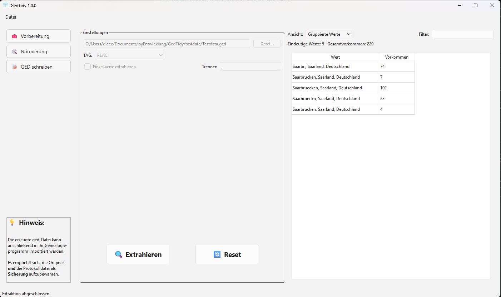
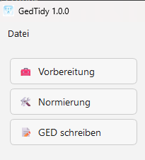
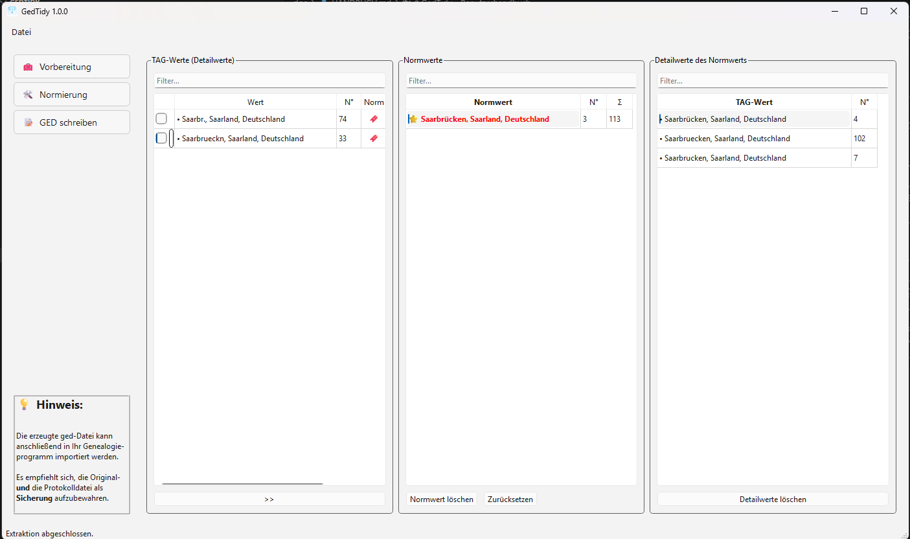
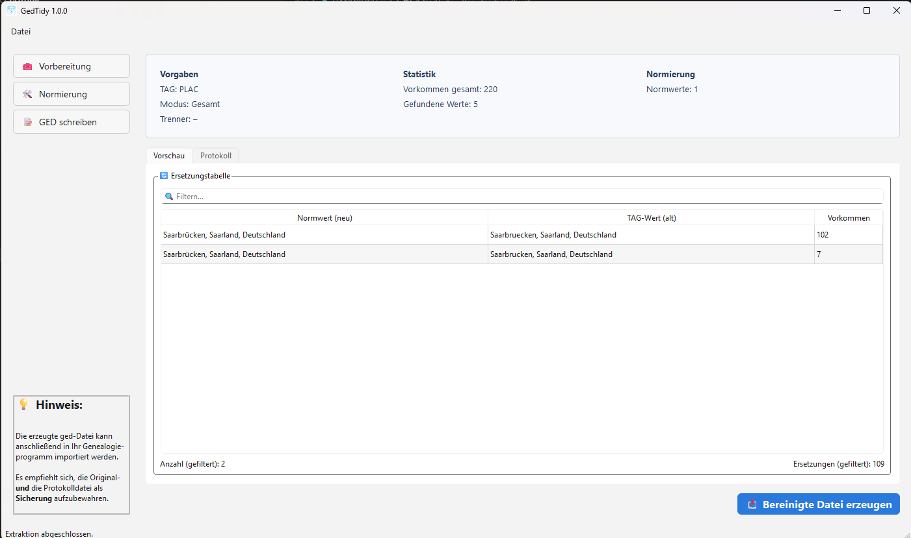
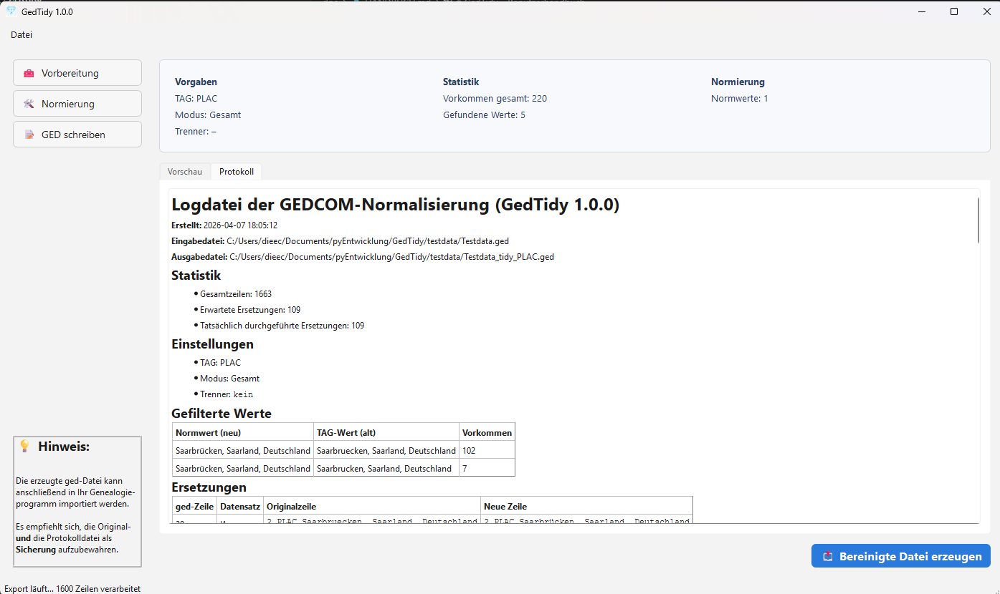
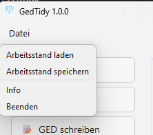

# GedTidy – Benutzerhandbuch 1.0.2

## 1. Überblick

**GedTidy** ist ein Werkzeug zur Analyse, Bereinigung und Vereinheitlichung von genealogischen Daten im **GEDCOM‑Format**.  
Es richtet sich an Anwenderinnen und Anwender, die:

- **mit GEDCOM‑Dateien arbeiten**  
- genealogische Daten aus verschiedenen Quellen zusammenführen  
- uneinheitliche Schreibweisen (z. B. Orte, Berufe, Freitextfelder) bereinigen möchten  

Typische Nutzer sind Ahnenforscher, Genealogie‑Vereine und Nutzer von Programmen wie Ahnenblatt, Legacy, Gramps, RootsMagic, FamilyTreeMaker usw.

---

## 2. Was ist eine GEDCOM‑Datei?

**GEDCOM** („GEnealogical Data COMmunication“) ist ein Textformat zum Austausch genealogischer Daten.

Ein Eintrag besteht aus:

- einer **Level‑Nummer** (z. B. `0`, `1`, `2`)  
- einem **TAG** (z. B. `NAME`, `BIRT`, `PLAC`, `OCCU`)  
- einem **Wert** (z. B. „Saarbrücken“, „Schreiner“, „Müller /Hans/“)

Beispiel:

```text
1 PLAC Saarbrücken, Saarland, Deutschland
2 NOTE Herkunft unklar
```

Typische Probleme:

- unterschiedliche Schreibweisen („Saarbrücken“, „Saarbruecken“, „Saarbr.“)  
- mehrere Werte in einem Feld  
- uneinheitliche Trennzeichen  
- Tippfehler  

**GedTidy** hilft, diese Werte zu analysieren, zu normieren und in eine bereinigte GEDCOM‑Datei zu überführen.

---

## 3. Programmoberfläche

### 3.1 Hauptfenster



**Bestandteile:**

- **Navigationsleiste links**  
  - 🧰 Vorbereitung  
  - 🛠️ Normierung  
  - 📝 GED schreiben  
- **Arbeitsbereich rechts**  
  - zeigt je nach Schritt unterschiedliche Inhalte  
- **Menüleiste oben**  
  - Datei → Arbeitsstand laden / speichern  
  - Info  
  - Beenden  
- **Statusleiste unten**  
  - Hinweise und Statusmeldungen

---

### 3.2 Navigation



Die Navigationsleiste enthält drei Hauptschritte:

1. **🧰 Vorbereitung**  
   - GEDCOM‑Datei wählen  
   - TAG auswählen  
   - Werte extrahieren  
2. **🛠️ Normierung**  
   - Schreibweisen zu Normwerten zusammenführen  
3. **📝 GED schreiben**  
   - bereinigte GEDCOM‑Datei erzeugen  
   - Protokoll einsehen  

Ein Klick auf einen Button wechselt den Arbeitsbereich zum entsprechenden Schritt.

---

## 4. Schritt 1 – Werte extrahieren (Vorbereitung)


### 4.1 Ziel

- GEDCOM‑Datei auswählen  
- TAG auswählen (z. B. `PLAC`, `OCCU`)  
  Der zu untersuchende TAG wird beim Start automatisch mit `PLAC` vorgegeben.
- Modus „Einzelwerte extrahieren“ und Trenner festlegen
  Der Modus startet standardmäßig im Gesamtmodus (der gesamte Wert des TAG wird normiert) 
  Einzelmodus kann aktiviert werden: Die TAG-Werte werden einzeln normiert (der Trenner kann festgelegt werden).
- Werte extrahieren  
- Tabellen `gruppierte TAG-Werten` und `Rohdaten` (wie sie aus der ged-Datei gelesen wurden mit ged-Datei-Zeilennummer
  und Datensatz-Zeiger  
- Tabellenfilter anwenden  

### 4.2 Bedienelemente

- **Datei…**  
  - öffnet einen Dateidialog zur Auswahl der GEDCOM‑Datei  
- **TAG‑Auswahl (ComboBox „TAG:“)**  
  - zeigt alle in der Datei vorkommenden TAGs  
- **Einzelwerte extrahieren**  
  - trennt Mehrfachwerte anhand des angegebenen Trenners  
- **Trenner (LineEdit „Trenner:“)**  
  - z. B. `, ` oder `;`  
- **🔍 Extrahieren**  
  - startet die Analyse und Extraktion  
- **🔄 Reset**  
  - setzt Eingaben und Ergebnisse zurück  
- **Ansicht (ComboBox „Ansicht:“)**  
  - „Gruppierte Werte“: jeder Wert einmal + Häufigkeit  
  - „Rohdaten“: jede Zeile einzeln  
- **Filter (LineEdit „Filter:“)**  
  - filtert die angezeigten Werte in der Tabelle  

### 4.3 Tabellen

- **Gruppierte Werte**  
  - Spalten: „Wert“, „Vorkommen“  
- **Rohdaten**  
  - Spalten: „Zeile“, „Pointer“, „Wert“  

Nach Abschluss der Extraktion erscheint eine Statusmeldung („Extraktion abgeschlossen.“),  
die automatisch nach einigen Sekunden ausgeblendet wird.

---

## 5. Schritt 2 – Normierung



### 5.1 Ziel

- unterschiedliche Schreibweisen zu **Normwerten** zusammenführen  
- Normwerte verwalten  
- Detailwerte eines Normwerts prüfen  

### 5.2 Bereiche

- **TAG‑Werte (links)**  
  - Tabelle mit allen extrahierten Detailwerten  
  - Filterfeld „Filter…“  
- **Normwerte (Mitte)**  
  - Tabelle mit allen definierten Normwerten  
  - Filterfeld „Filter…“  
  - Buttons:
    - **Normwert löschen**  
    - **Zurücksetzen** (alle Normwerte löschen)  
- **Detailwerte des Normwerts (rechts)**  
  - zeigt alle Detailwerte, die einem Normwert zugeordnet sind  
  - Filterfeld „Filter…“  
  - Button: **Detailwerte löschen**  

Die Tabellen verfügen über eine stabile Sortierlogik, die auch bei Filterung und Navigation erhalten bleibt.


### 5.3 Zuordnen von Werten

- Auswahl eines oder mehrerer Tag-Wert links  
- Auswahl eines Normwerts in der Mitte oder Anlegen eines neuen (je nach Implementierung)  
- Klick auf **»** 
- Die Werte werden dem Normwert zugeordnet und erscheinen im rechten Bereich.

**Doppelklick** auf einen Tag-Wert links ordnet diesen Wert direkt dem aktuellen Normwert zu

### 5.4 Verhalten bei aktivem Filter der Normwert-Tabelle (Mitte)

Wenn ein Normwert ausgewählt oder neu angelegt wird, der nicht zum aktuellen Filter passt, bleibt er dennoch sichtbar.  
Dies erleichtert die Kontrolle der Zuordnung.

Sobald ein anderer Normwert ausgewählt oder eine neue Zuordnung vorgenommen wird, verschwindet der zuvor sichtbare, aber nicht passende Normwert wieder aus der Liste.

GedTidy informiert über dieses Verhalten durch:
- eine Statusmeldung in der Statusleiste  
- Normwerte, die nicht zum Filter passen, aber aktuell ausgewählt sind, bleiben sichtbar.
- Beim Ein‑ oder Ausblenden eines Normwerts zeigt GedTidy eine Statusmeldung und gibt einen kurzen Systemton aus.
- Alle drei Tabellen (links, Mitte, rechts) besitzen jetzt Filterfelder mit Clear‑Button, um Filter schnell zurückzusetzen.

---

## 6. Schritt 3 – Bereinigte Datei erzeugen


### 6.1 Ziel

- Ersetzungstabelle prüfen  
- Protokoll einsehen  
- bereinigte GEDCOM‑Datei erzeugen  

### 6.2 Zusammenfassung

Im oberen Bereich (Frame „Vorgaben / Statistik / Normierung“):

- **Vorgaben**  
  - TAG  
  - Modus  
  - Trenner  
- **Statistik**  
  - Vorkommen gesamt  
  - gefundene Werte  
- **Normierung**  
  - Anzahl Normwerte  

### 6.3 Ersetzungstabelle

- **Ersetzungstabelle (Tab „Vorschau“)**  
  - Spalten:
    - „Normwert (neu)“  
    - „TAG‑Wert (alt)“  
    - „Vorkommen“  
  - Filterfeld „🔍 Filtern…“  
  - Anzeige:
    - „Anzahl (gefiltert): …“  
    - „Ersetzungen (gefiltert): …“  
  - Die Tabelle wird beim Öffnen von Schritt 3 automatisch nach `Normwert (neu)` sortiert.

### 6.4 Protokoll

- **Tab „Protokoll“**  
  - zeigt ein Markdown‑Protokoll  
  - dokumentiert die vorgenommenen Ersetzungen  
  - Links können extern geöffnet werden (z. B. Hinweise, Dokumentation)

### 6.5 Datei erzeugen

- **📤 Bereinigte Datei erzeugen**  
  - schreibt eine neue GEDCOM‑Datei  
  - verwendet die definierte Ersetzungstabelle  
  - erzeugt eine Protokolldatei  



---

## 7. Arbeitsstände speichern und laden

Ü
ber das Menü **Datei**:

- **Arbeitsstand laden**  
  - lädt einen zuvor gespeicherten Zustand (Normwerte, Einstellungen, Zuordnungen)  
    Nach dem Laden oder Verwerfen eines Arbeitsstands zeigt GedTidy eine Statusmeldung an  
    (z. B. „Import erfolgreich übernommen.“ oder „Import abgebrochen.“).  
    Diese Meldungen verschwinden automatisch nach einigen Sekunden.
- **Arbeitsstand speichern**  
  - speichert den aktuellen Zustand  
- **Beenden**  
  - beendet das Programm  
- **Info**  
  - zeigt Informationen zu GedTidy (Version, Autor, Hinweise)

---

## 8. Schritt‑für‑Schritt‑Beispiel: Eine einfache Sitzung

In diesem Beispiel wird eine GEDCOM‑Datei bereinigt, in der Ortsangaben (`PLAC`) uneinheitlich sind.

### 8.1 Ausgangssituation

In der GEDCOM‑Datei kommen u. a. folgende Werte vor:

- `Saarbrücken, Saarland, Deutschland`  
- `Saarbruecken, Saarland, Deutschland`  
- `Saarbr., Saarland, Deutschland`  

Ziel: Alle sollen zu **„Saarbrücken, Saarland, Deutschland“** vereinheitlicht werden.

---

### 8.2 Schritt 1 – Werte extrahieren

1. **Programm starten**  
   - GedTidy öffnen.  
2. **Navigationspunkt „🧰 Vorbereitung“ wählen**  
   - Links auf „Vorbereitung“ klicken.  
3. **GEDCOM‑Datei auswählen**  
   - Auf **„Datei…“** klicken.  
   - GEDCOM‑Datei (z. B. `daten.ged`) auswählen.  
4. **TAG auswählen**  
   - In der ComboBox „TAG:“ den Eintrag **`PLAC`** wählen.  
5. **Einzelwerte extrahieren (optional)**  
   - Wenn mehrere Orte in einem Feld stehen, **„Einzelwerte extrahieren“** aktivieren.  
   - Trenner z. B. `, ` belassen oder anpassen.  
6. **Extraktion starten**  
   - Auf **„🔍 Extrahieren“** klicken.  
7. **Ergebnis prüfen**  
   - Ansicht „Gruppierte Werte“:  
     - Tabelle zeigt alle Ortsangaben mit Häufigkeit.  
   - Ansicht „Rohdaten“:  
     - Tabelle zeigt jede Zeile mit Zeilennummer und Pointer.  
   - Optional: Filter verwenden, z. B. „Saarbr“ eingeben.

---

### 8.3 Schritt 2 – Normierung

1. **Navigationspunkt „🛠️ Normierung“ wählen**  
   - Links auf „Normierung“ klicken.  
2. **TAG‑Werte ansehen (links)**  
   - Tabelle zeigt alle extrahierten Ortswerte.  
   - Filterfeld nutzen, z. B. „Saarbr“.  
3. **Normwert definieren**  
   - In der Mitte (Normwerte) den gewünschten Zielwert anlegen oder auswählen:  
     - **„Saarbrücken, Saarland, Deutschland“**  
4. **Werte zuordnen**  
   - Links die Varianten markieren:
     - `Saarbruecken, Saarland, Deutschland`  
     - `Saarbr., Saarland, Deutschland`  
   - Normwert in der Mitte auswählen.  
   - Auf **„>>“** klicken.  
5. **Zuordnung prüfen**  
   - Rechts (Detailwerte des Normwerts) erscheinen nun alle zugeordneten Varianten.  
   - Filter nutzen, um die Liste zu kontrollieren.  
6. **Weitere Normierungen vornehmen**  
   - Nach Bedarf weitere Werte und Normwerte bearbeiten.  

---

### 8.4 Schritt 3 – Bereinigte Datei erzeugen

1. **Navigationspunkt „📝 GED schreiben“ wählen**  
   - Links auf „GED schreiben“ klicken.  
2. **Zusammenfassung prüfen**  
   - Oben: TAG, Modus, Trenner, Statistik, Anzahl Normwerte.  
3. **Ersetzungstabelle prüfen**  
   - Tab „Vorschau“:  
     - Spalten:
       - „Normwert (neu)“  
       - „TAG‑Wert (alt)“  
       - „Vorkommen“  
     - Filter nutzen, z. B. „Saarbr“.  
4. **Protokoll ansehen**  
   - Tab „Protokoll“:  
     - zeigt eine Übersicht der vorgenommenen Ersetzungen.  
5. **Bereinigte Datei erzeugen**  
   - Auf **„📤 Bereinigte Datei erzeugen“** klicken.  
   - Speicherort und Dateiname wählen (z. B. `daten_bereinigt.ged`).  
6. **Ergebnis verwenden**  
   - Die bereinigte GEDCOM‑Datei in das Genealogieprogramm importieren.  
   - Protokolldatei und Originaldatei als Sicherung aufbewahren.

---

## 9. Best Practices

- **Originaldatei nie überschreiben**  
  - immer eine Kopie bearbeiten  
- **Protokoll aufbewahren**  
  - zur Nachvollziehbarkeit der Änderungen  
- **Normwerte konsistent halten**  
  - z. B. immer „Ort, Bundesland, Land“  
- **Schrittweise arbeiten**  
  - zuerst Orte, dann Berufe, dann andere Freitextfelder  
